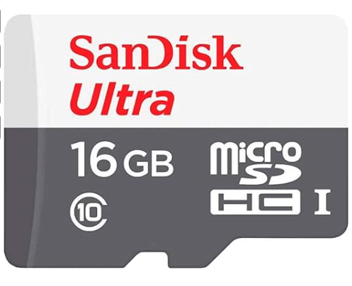
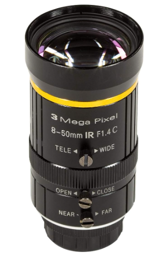
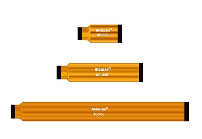
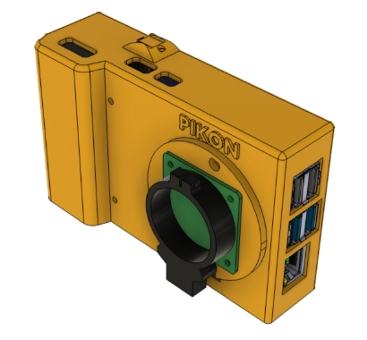
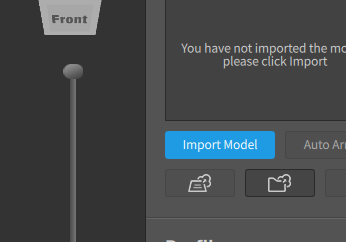
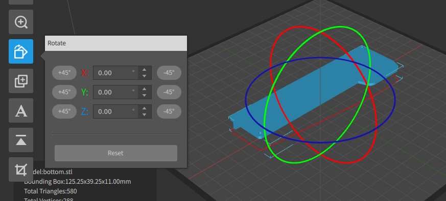
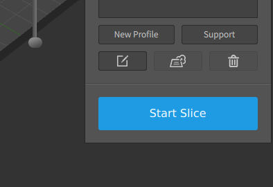
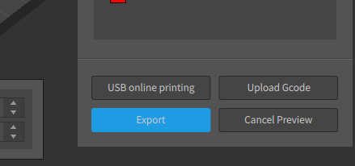

# DIY Camera

## Requirements

| Name | Description | Image | Link |
| --- | --- | --- | --- |
| Raspberry Pi 3B+ (tested) | Works with 2/3 or 4 | - | -  |
| Micro SD Card | SanDisk Ultra 16GB 80MB/s |  | [Link](https://www.amazon.com.mx/dp/B074B4P7KD?ref=ppx_pop_mob_ap_share) |
| Camera Sensor | Arducam Camera Sensor IMX477 with C-CS Adapter |  | [Link](https://www.amazon.com.mx/dp/B09YHN5DBY?ref=ppx_pop_mob_ap_share) |
| Camera Lens | Arducam Zoom C-Mount Lens 8-50mm for Camera IMX477 |  | [Link](https://www.amazon.com.mx/dp/B08PYMBX9T?ref=ppx_pop_mob_ap_share) |
| Ribbon Cable | FPC Ribbon Cable 22 to 15 pins, 15cm or shorter |  | [Link](https://www.amazon.com.mx/Arducam-extensi%C3%B3n-Raspberry-pulgadas-unidades/dp/B085RW9K13/ref=asc_df_B085RW9K13/?tag=gledskshopmx-20&linkCode=df0&hvadid=673377511327&hvpos=&hvnetw=g&hvrand=12627621543486268431&hvpone=&hvptwo=&hvqmt=&hvdev=c&hvdvcmdl=&hvlocint=&hvlocphy=9130911&hvtargid=pla-970838553569&psc=1&mcid=bbc16897815637ac8670aa9edfbd43d8) |

## 3D Prints

- Case 

The case for this camera is not mine, I printed Pikon Camera 3D model from [here](https://www.kevsrobots.com/blog/pikon-camera.html).



- For 3D printing, I'm using:

    - Ender 3 Model V1

- The steps for 3D printing are

1. Download the Crealty Print Software app image from [here](./res/3d-print/Creality_Print-v3.11.1-Ubutu-x86_64-Release.AppImage). Since it's a portable software, you don't need to install what you download.

2. Give execution permissions to the `.AppImage` file you downloaded:

```
chmod +x ./Creality_Print-v3.11.1-Ubutu-x86_64-Release.AppImage
```

3. Execute the software:

```
./Creality_Print-v3.11.1-Ubutu-x86_64-Release.AppImage
```

4. Click on **Import Model** button in the right side menu:



5. Select one of the three .STL files you downloaded for the case section.

6. Rotate it with the blue button so that the supports are easily removable.



7. Once you're finished, click on **Start Slice**.



8. Click on **Export** and name the file as you wish. This will result in a `.gcode` file that your Ender 3 will be able to read.



9. Copy the `.gcode` files to a Micro SD so that you can print it from there.

## Set Up

TBD
