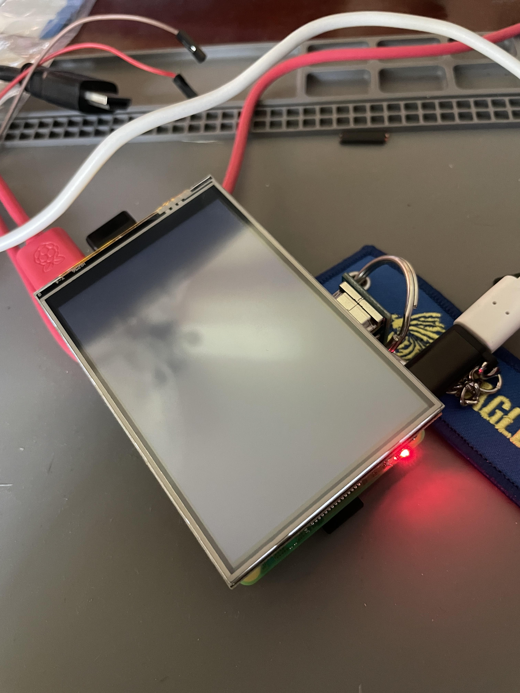

# DIY Camera

## Requirements

| Name | Description | Image | Link |
| --- | --- | --- | --- |
| Raspberry Pi 3B+ (tested) | Works with 2/3 or 4 | - | -  |
| Micro SD Card | SanDisk Ultra 16GB 80MB/s |  | [Link](https://www.amazon.com.mx/dp/B074B4P7KD?ref=ppx_pop_mob_ap_share) |
| Camera Sensor | Arducam Camera Sensor IMX477 with C-CS Adapter |  | [Link](https://www.amazon.com.mx/dp/B09YHN5DBY?ref=ppx_pop_mob_ap_share) |
| Camera Lens | Arducam Zoom C-Mount Lens 8-50mm for Camera IMX477 |  | [Link](https://www.amazon.com.mx/dp/B08PYMBX9T?ref=ppx_pop_mob_ap_share) |
| Ribbon Cable | FPC Ribbon Cable 22 to 15 pins, 15cm or shorter |  | [Link](https://www.amazon.com.mx/Arducam-extensi%C3%B3n-Raspberry-pulgadas-unidades/dp/B085RW9K13/ref=asc_df_B085RW9K13/?tag=gledskshopmx-20&linkCode=df0&hvadid=673377511327&hvpos=&hvnetw=g&hvrand=12627621543486268431&hvpone=&hvptwo=&hvqmt=&hvdev=c&hvdvcmdl=&hvlocint=&hvlocphy=9130911&hvtargid=pla-970838553569&psc=1&mcid=bbc16897815637ac8670aa9edfbd43d8) |
| 3.5 inch HDMI Display | Osoyoo HDMI display 3.5 inches |  | [Link](https://a.co/d/3jZ4wrx)

## 3D Prints

- Case 

The case for this camera is not mine, I printed Pikon Camera 3D model from [here](https://www.kevsrobots.com/blog/pikon-camera.html).


- For 3D printing, I'm using:

    - Ender 3 Model V1

- The steps for 3D printing are

1. Download the Creality Print Software app image from [here](https://www.creality.com/pages/download-software). Since it's a portable software, you don't need to install what you download.

2. Give execution permissions to the `.AppImage` file you downloaded:

```
chmod +x ./Creality_Print-v3.11.1-Ubutu-x86_64-Release.AppImage
```

3. Execute the software:

```
./Creality_Print-v3.11.1-Ubutu-x86_64-Release.AppImage
```

4. Click on **Import Model** button in the right side menu:


5. Select one of the three .STL files you downloaded for the case section.

6. Rotate it with the blue button so that the supports are easily removable.


7. Once you're finished, click on **Start Slice**.


8. Click on **Export** and name the file as you wish. This will result in a `.gcode` file that your Ender 3 will be able to read.


9. Copy the `.gcode` files to a Micro SD so that you can print it from there.

## Set Up

You must download the OS version: `2022-01-28-raspios-bullseye-arm64-full` from [here](https://downloads.raspberrypi.com/raspios_full_arm64/images/).

1. Plug your Micro SD Card into your pc and check its name:

```
sudo fdisk -l
```

2. Unmount the card. Since my card has another OS burned already, it has two partitions (shown in above command), so I unmounted both:

```
sudo umount /dev/sdb1
sudo umount /dev/sdb2
```

3. Burn the image onto the Micro SD Card

```
sudo dd bs=4M if=~/Downloads/2022-01-28-raspios-bullseye-arm64-full.img of=/dev/sdb status=progress
sync
sudo eject /dev/sdb
```

## OS Configs

1. Install libcamera by either of the two ways:

a) From source

```
git clone https://github.com/raspberrypi/libcamera.git
cd libcamera/
mkdir build
cd build
cmake ..
cd ..
meson setup build
sudo apt install meson
meson setup build
ninja -C build install
libcamera
```

b) With the package manager

```
sudo apt install libcamera-apps
sudo apt-install -y python3-pyqt5 python3-opengl python3-picamera2
```

2. Open firmware configs:

```
sudo raspi-config
```

3. Navigate to **Advance Options**  and **Enable Glamor Graphic Acceleration**. Optionally, also in **Advanced Options** you can **Enable Legacy Camera**.

4. Go back to **Advanced Options** and navigate to **GL Driver**, select **GL (Full KMS)**

5. Reboot

```
sudo reboot
```

6. Modify the config file with `sudo vim ~/boot/config.txt`:

- `~/boot/config.txt`: Make sure this is under the `[all]` section:

```
...
[all]
gpu_mem=128
camera_auto_detect=0
dtoverlay=imx477
```

Also, uncomment the line with `dtoverlay=vc4-kms-v3d`.

7. Show a preview of the camera image:

```
libcamera-still -t 0
```

**Important:** if the preview shows an all-black image, try adjusting all the lens' lighting, since often times the configs are all messed up. Twist the lens.

## Display

The display used here was at first the classic 3.5 inch GPIO-based display, but when I connected the camera module, it wouldn't work at all. I figured that the camera preview that we use inside the Qt app sends the output *directly to HDMI*. Using a GPIO-connected display would mean to copy somehow the HDMI output to anything similar, which means a delay, which means too much work. The easy way out is to buy a display that works with HDMI. Therefore, I suggest strongly to use a 3.5 inch that connects to the Pi **with HDMI**. 

The display I linked here worked with the camera module but you definitely need to tweak some stuff.

1. Connect your raspberry pi to the display. Now we need to install the driver for it.

2. Turn on the Pi and open a terminal:

```
git clone https://github.com/osoyoo/HDMI-show.git
```

3. Give the folder the rights.

```
sudo chmod -R 777 HDMI-show
```

4. Enter the directory:

```
cd HDMI-show/
```

5. Run the script:

```
sudo ./hdmi35-480x320-show
```

This will automatically reboot your pi. In my case, the reboot didn't end up working, and left my pi with a blank screen:



If, for any reason, your screen goes blank and never shows the desktop properly, you need to do this:

a. Plug your SD card into a PC

b. Go to boot folder

c. Open in a text editor the file `/boot/config.txt`. Through the installation we just did, Osoyoo adds these lines to your original `config.txt` file:

```
dtoverlay=vc4-fkms-v3d
hdmi_group=2
hdmi_mode=87
hdmi_drive=1
hdmi_pixel_freq_limit=20000000
hdmi_cvt 480 320 60 6 0 0 0
dtoverlay=ads7846,cs=1,penirq=25,penirq_pull=2,speed=50000,keep_vref_on=0,swapxy=0,pmax=255,xohms=150,xmin=200,xmax=3900,ymin=200,ymax=3900
```

In my raspberry pi 3b+ model, I needed to comment the line:

```
#hdmi_pixel_freq_limit=20000000
```

For it to work again. That's it. You can visit the driver's repo here to know what else goes under the hood [here](https://github.com/osoyoo/HDMI-Show/blob/main/hdmi35-480x320-show).